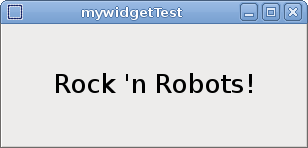
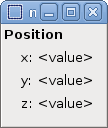
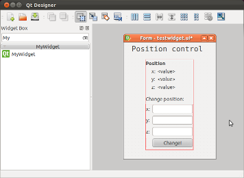
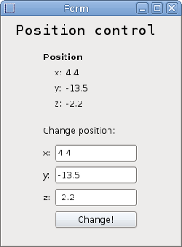
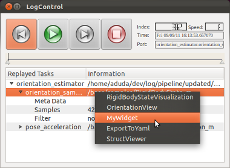

Abstract
-----------
In this tutorial you will learn how to create a C++ vizkit widget for displaying 
2D data like images, numbers and text.

For more general information about graphical user interface programming in Rock,
see [here](../graphical_user_interface/).

Create Qt Designer Widget
-----------
All vizkit widgets written in C++ are based on Qt Designer Widgets which are
fully accessible via qt ruby. As a starting point, the command line program
rock-create-vizkit-widget generates the basic folder layout and 
a ready-to-use Qt Designer widget example.

~~~ bash
$ rock-create-vizkit-widget MyWidget
~~~

This will create a new folder in the current directory named MyWidget.
The folder layout looks much like a Rock library. The relevant code has been 
generated into src/. You can compile and install this widget via *amake* and it works
out of the box. However, you might want to customize the widget source file 
(in our case: MyWidgetPlugin.cc) first, e.g. change the widget group, domXml 
specification, etc.

The widget is automatically being installed as normal qt designer widget into Rock's 
designer widget path: install/lib/qt/designer/ and can be used by the qt designer like every other
widget to design custom ui files.

If you encounter problems with the qt designer, it might help to delete old widgets from the install location
(which is also done by *autoproj rebuild*. But as your project grows, you should realize that this command starts a complete rebuild of your project which can result in hours of compilation. Stick to the local version, then: *autoproj rebuild .* .) 
{: .warning}

To test your widget after it was built and installed, call the following command on the command line: 

~~~ bash
$ ruby scripts/test.rb
~~~

Without changes, the generated sample widget should look like this:

{: .align-center}

Access widget from Ruby
-----------
Now that we know how to create a widget, we want to use it. Therefore we want to
create a user interface with the Qt Designer containing our widget.

Since the default widget is an adapted "Hello World!", we implemented something
more useful: a simple position display showing the three values of a vector and a slot 
called setPose with takes a base::samples:RigidBodyState as argument.

**Limitations** The standard Qt/Ruby bindings do not support arbitrary types as arguments. Currently, the following limitations apply in Rock when calling C++ slots from Ruby.

 * if all arguments and return values are standard C++ or Qt types, the only
   limitation is a maximum of 10 arguments
 * if any argument is a type registered on oroGen (i.e. a type that is used in
   a property, port or operation), that would show up with rock-inspect, then
   Qt types are not allowed in the call and there should be no return value. The
   limitation of max. 10 arguments still apply since it is a Qt limitation.

{: .align-center}

In order to create a custom user interface specification start the Qt
Designer, run _designer_ from a sourced shell. This way, Rock's designer widget
path is loaded and you can select your widget from the toolbox.  Our user
interface shows our position display widget and some control fields to update
the position called x_edit, y_edit, z_edit and but_set_pos. We save it to scripts/testwidget.ui .

{: .align-center}

Now we write a simple Qt Ruby widget using our user interface and name it test2.rb. All 
widgets contained in testwidget.ui are accessible via their object name on the top level
of the main widget.

~~~ ruby
#! /usr/bin/env ruby

require 'vizkit'

Orocos.initialize
Orocos.load_typekit_for "/base/samples/RigidBodyState"

class TestWidget < Qt::Widget
  
  def initialize
    super
    #load ui file
    @window = Vizkit.load(File.join(File.dirname(__FILE__),
                          'testwidget.ui'))
    @window.setParent(self)

    #connet qt signal with a ruby method
    @window.but_set_pos.connect(SIGNAL('clicked()'),self,
                                :change_position)
    
    #activate calling Qt slots with oroGen types
    @window.mywidget.extend Vizkit::QtTypelibExtension
  end
  
  def change_position
    if(!@window.x_edit.text.empty? && 
      !@window.y_edit.text.empty? && 
      !@window.z_edit.text.empty?)
      # Generate type from user input
      rbs = Types::Base::Samples::RigidBodyState.new
      rbs.position[0] = Float(@window.x_edit.text)
      rbs.position[1] = Float(@window.y_edit.text)
      rbs.position[2] = Float(@window.z_edit.text)

      #call slot on the c++ widget 
      @window.mywidget.setPose(rbs)
    end
  end
end

tw = TestWidget.new
tw.show

Vizkit.exec
~~~

Running test2.rb opens our user interface:

{: .align-center}

Register the Widget to be accessible via TaskInspector and RockReplay
-----------
If you want to use your widget for displaying custom data types via rock-replay or the 
task-inspetor you have to write some glue code, register the widget for the specific type 
and install the glue code in install/lib/qt/desinger/cplusplus_extensions. A template for
this can be found in the src folder of your widget called vizkit_widget.rb which is already 
automatically being installed at the right location.

This code registers our widget for the type /base/samples/RigidBodyState

~~~ ruby
Vizkit::UiLoader::extend_cplusplus_widget_class "MyWidget" do

  #called when the widget is created
  def initialize_vizkit_extension
    #activate calling Qt slots with oroGen types
    extend QtTypelibExtension
  end

  #called each time vizkit wants to display a new 
  #port with this widget
  def config(value,options)

  end

  #called each time new data are available on the 
  #orocos port connected to the widget the name is
  #custom and can be set via register_widget_for
  def update(sample,port_name)
    setPose(sample)
  end
end

# register widget for a specific oroGen type to be 
# accessible via rock tooling (rock-replay,...)
# multiple register_widget_for are allowed for each widget
Vizkit::UiLoader.register_widget_for("MyWidget",
                                     "/base/samples/RigidBodyState",
                                     :update)
~~~

After the script is being installed via _autoproj_ _build_ _._  or _amake_ all rock tools are aware of 
the widget and you could display log files or live data by just selecting your widget 
from the pull-up menu.

{: .align-center}

Summary
-----------
You are now able to create C++ vizkit widget which can be used in the Qt Designer and 
all standard rock tools.

The example code used for this tutorial is packaged with the other tutorials and can be found
[here](https://github.com/rock-tutorials/tutorials-designer_widget_tutorial)

Progress to the [next tutorial](600_vizkit_plugin.html).

