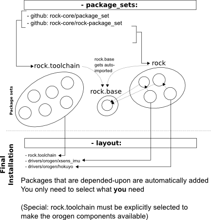

This page describes the structure of a autoproj installation, and describes how
to manage one. See [the introduction](index.html) for the bootstrapping process.

Structure
---------

!
{: .full}

The autoproj configuration and build process goes like this:

 * a set of packages are declared in _package sets_. These package sets can
   either be local (saved along with the rest of the autoproj configuration) or
   remote (imported from a VCS). They declare how to get, build and install
   a certain number of packages. On the image above, there are three of those
   sets: rock.base, rock.toolchain and rock
 * packages that are relevant to the local installation are cherry-picked from
   the package sets. One can either select packages one-by-one (the case for the
   two packages of rock above), or a package set can be imported as a
   whole (rock.toolchain and rock.base).
 * autoproj will then import the selected packages, auto-select their
   dependencies and import them as well, build and install all of this.
 * the selected packages can be imported and built in subdirectories of the
   installation tree. In the above example, all packages from rock.toolchain are
   built in the tools/ subdirectory, one package of rock in the
   perception/ subdirectory and so on.

In practice, the autoproj configuration is saved in an autoproj/ directory. It
is split like this:

 * autoproj/manifest: list of available package sets, package selection and
   installation layout (where to put what).
 * autoproj/\*/: local sets, i.e. sets that have not been imported from a remote
   version control system.
 * autoproj/remotes/\*/: package sets that are imported from a remote version
   control system
 * autoproj/init.rb, autoproj/overrides.rb and autoproj/overrides.yml:
   installation customization

The build is done in two steps:

 * each package is being built in a <tt>build</tt> subdirectory of the package's
   source (<tt>package_directory/build/</tt>)
 * it is then installed in the build/ directory at the toplevel of the autoproj
   installation

Moreover, the <tt>build/log</tt> directory contains the output of all commands
that have been run during the build.

Finally, a <tt>env.sh</tt> script is generated to set up your shell for the use
of the installed software.

Listing and adding package sets
-------------------------------
Package sets are listed in the <tt>package_sets</tt> section of
<tt>autoproj/manifest</tt> file. This section looks like this:

~~~ yaml
package_sets:
  - imoby
  - type: git
    url:  git://github.com/rock-core/package_set
~~~

It lists both local and remote sets that are available for this installation.
Local sets are subdirectories of the <tt>autoproj/</tt> directory: for instance,
in the above example, autoproj will look at the <tt>autoproj/imoby/</tt>
directory. Remote sets are taken from remote version control systems. Its
general format is:

~~~ yaml
  - type: version_control_type # git, svn, cvs, darcs
    url: repository_url
~~~

For the git importer, one of 'branch' or 'tag' options can be provided as well:

~~~ yaml
  - type: version_control_type # git, svn, cvs, darcs
    url: repository_url
    branch: branch_to_track
    tag: tag_to_stick_to # it is branch OR tag
~~~

Imported package sets are saved in the <tt>.remotes</tt> directory of the
autoproj installation. The importers that are available for configuration are
the same than the ones available for the packages themselves, so see [this
page](advanced/importers.html#all_importers) for the list of available importers.

Listing the available packages.
-----------------------------
Once you have updated your manifest file to list all the package sets that you
want to use, you can list all the packages that are now available with

autoproj list-sets
{: .commandline}

Its output looks like this:

    orocos.toolchain (imported by rock.core)
      from:  git:git://github.com/orocos-toolchain/autoproj.git push_to=git@github.com:/orocos-toolchain/autoproj.git
      local: /media/Data/dfki/hrov/autoproj/remotes/orocos.toolchain
      defines: log4cpp, ocl, orogen, rtt, rtt_typelib, stdint_typekit, typelib, utilmm, utilrb
    rock (listed in manifest)
      from:  git:git://github.com/rock-core/rock-package_set.git push_to=git@github.com:/rock-core/rock-package_set.git
      local: /media/Data/dfki/hrov/autoproj/remotes/rock
      defines: [snip]
    rock.core (listed in manifest)
      from:  git:git://github.com/rock-core/package_set.git push_to=git@github.com:/rock-core/package_set.git
      local: /media/Data/dfki/hrov/autoproj/remotes/rock.core
      imports 2 package sets
        orocos.toolchain
      defines: [snip]

The first line is the **package set name**. It is defined in the package set's
source.yml file and does not necessarily have a relationship with the name of
the repository it is stored into.

The second line tells you where this set comes from. It is local if it comes
along with the main autoproj configuration (manifest and so on). It is remote
if it is imported from a version control system.

Finally comes the list of packages that are defined in this set.

Picking the packages to build
-----------------------------
If you do not wish to build all the packages that are available (you rarely
wish that), you have to list the desired packages in your manifest file.

To do so, you will have to create a <tt>layout</tt> section and list the
desired packages:

~~~ yaml
layout:
  - rock.base
  - orogen
~~~

This layout can either list packages one by one, but complete package sets can
also be selected (as e.g. rock.base above)

More advanced mechanisms are available to customize this list. These mechanisms
are [detailed here](customization.html)

