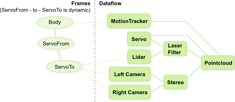

In the example used [for the stream aligner](stream_aligner.html), we introduced
the (very common) use case of having a sensor giving some geometrical
information in some (usually moving) frame, but the need to have this data in
another frame:

{: .align-center}

In this example, the output of the "Pointcloud" processing should be expressed
in a frame that is centered on the body. Moreover, the laser filtering
processing is supposed to remove the body parts of the robot from the lidar
scan, which means that it should be able to express the position of the lidar
echoes in the body frame (or the position of the body parts in the lidar frame).

Since there is a moving servo between the body and the sensors, this requires a
bit of processing. Moreover, if one wants to build processing components that do
not require an intimate knowledge about each robot's kinematic structures, there
is a need for some infrastructure.

That's the job of the transformer:

 * allow each processing component to specify the frame transformations that it
   requires during its processing
 * provide runtime support to make sure that the required transformations are
   made available to the components, regardless of the fact that they are static
   or dynamic (i.e. require some connections to components that provide them).

This page, as well as the next ones, will deal with explaining these issues.

