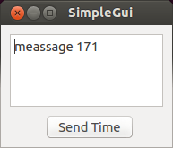

Vizkit is a quit powerful tool to connect Qt widgets written in C++ or ruby with Orocos 
tasks. It is based on Orocos::Async API and 
[qtruby](http://techbase.kde.org/Development/Languages/Ruby).

Main Features:

  * event driven design which fits well to qt slots and signals
  * asynchronous communication with Orocos tasks
  * auto connect and reconnect 
  * connection sharing across all data consumer and producer belonging to the same ruby process
  * unified error handling and propagation

To show how to create a simple
[GUI](https://raw.githubusercontent.com/rock-core/base-doc/master/src/documentation/graphical_user_interface/simple_gui.ui),
a small example is used consisting of
three elements.  A window, a button and a text field. The text field displays
text messages send by a remote task and if the button is clicked a message is
sent from the GUI to the remote Orocos task.

{: .align-center}

The following code connects the GUI generated by the Qt Designer with a remote
task called
[simple_task](https://raw.githubusercontent.com/rock-core/base-doc/master/src/documentation/graphical_user_interface/simple_task.rb).
For this Vizkit uses the default CORBA name service to resolve the task name and
automatically reconnects if the task was restarted.

~~~ ruby
# loading library
require 'vizkit'

# initialize Orocos layer
Orocos.initialize

# load GUI created with the Qt Designer
widget = Vizkit.load "simple_gui.ui"
widget.show

# connect the widget with the task "simple_task"
widget.connect_to_task "simple_task" do |task|

    # connect the output port text_message with the text box slot setText
    text_box.connect PORT(:text_message), SLOT("setText(QString)")

    # generate a new sample each time the button is clicked
    # and show a message box if there is a connection error
    g = lambda{"it is #{Time.new.to_s}"}
    c = lambda{|msg| Qt::MessageBox.warning(widget,"ComErr",msg) if msg != "OK"}
    button.connect SIGNAL(:clicked), PORT(:input),:getter => g,:callback => c

    # disable the GUI until the task is reachable
    task.on_reachable {widget.setEnabled(true)}
    task.on_unreachable {widget.setEnabled(false)}
end

#run qt main loop
Vizkit.exec
~~~

In the next example Vizkit is used to display the images taken by a camera.  If
Vizkit cannot find a specialised widget to visualize a message a tree view
widget is used to display all data fields. This mechanism can easily be extended
by custom widgets (see [this page](600_writing_vizkit_widget.html))

~~~ ruby
require 'vizkit'
Orocos.initialize

# create a TaskContextProxy which automatically connects to a remote task 
# called "camera" when available
camera = Orocos::Async.proxy("camera")

# display output port frame as soon as the port is reachable
camera.port("frame").once_on_reachable do
    Vizkit.display camera.port("frame")
end

Vizkit.exec
~~~

{: .align-center}

Each Orocos::Async object has a number of events which can be used to change the state
of GUI. The most important ones are listed below.

~~~ ruby
# create a TaskContextProxy which automatically connects to a remote task 
# called "camera" when available
camera = Orocos::Async.proxy("camera")
port = camera.port("frame")

camera.on_reachable do 
    puts "camera is reachable"
end
camera.on_unreachable do 
    puts "camera is no longer reachable"
end
camera.on_error do |error|
    puts "camera error #{error}"
end
camera.on_state_change do |state|
    puts "camera state changed to #{state}"
end

port.on_reachable do 
    puts "port is reachable"
end
port.on_unreachable do 
    puts "port is no longer reachable"
end
port.on_error do |error|
    puts "port error #{error}"
end
port.on_data do |data|
    puts "port received #{data}"
end
~~~

