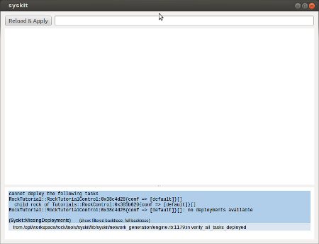
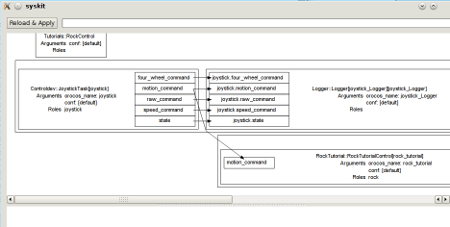
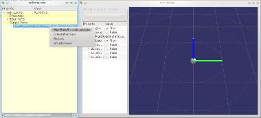

The result of this tutorial can be found in bundles/tutorials_scripts if you
followed the instructions at the bottom of [this page](../tutorials/index.html)
{: .note}

Abstract
------------
In this tutorial, you will learn how to write a simple model-based application,
and the most important tools that exist to run and debug it.

Note that this tutorial does require a (physical) joystick. The virtual joystick
won't work. However, if you don't have one, you can do everything in this
tutorial except running the generated component network. Moreover, the follow-up
tutorials will not need the joystick anymore, so if you don't have one, we
suggest that you go through this tutorial anyway (just reading the running part)
and go on with the follow-up tutorials.
{: .warning}

A first model-based script
------------
The root concept in Syskit is the _composition_. A
composition is a group of components that, once bound together, do something
useful. In our case, it would be moving the rock with a joystick. Create a new
file scripts/01_joystick.rb and add the following code:

~~~ ruby
#### MODELLING
# This part does not need any running components
#
# Make the needed oroGen projects available. The names are
# oroGen project names.
using_task_library 'controldev'
using_task_library 'rock_tutorial'

module Tutorials
  # Declare the composition
  class RockControl < Syskit::Composition
    # With one joystick. Note that the oroGen project names
    # are converted from snake_case to CamelCase (controldev
    # => Controldev, rock_tutorial => RockTutorial). This is
    # done consistently in the system management layer
    add Controldev::JoystickTask, :as => "cmd"
    # And one rock
    add RockTutorial::RockTutorialControl, :as => "rock"
    # Create any unique connection possible, by matching input
    # and output ports of the same data type. If ambiguities
    # exist, an error is generated
    cmd_child.connect_to rock_child
  end
end

#### SYSTEM REQUIREMENTS
# This part specifies what should actually run
#
# Tell the system which deployments to use. The names are
# deployment names, i.e.  the name given to the deployment
# "deployment_name" blocks in oroGen projects
Syskit.conf.use_deployment 'joystick'

# Finally, ask the system to run such a composition
add_mission Tutorials::RockControl
~~~

Checking the script and running the network
-------------------
As this _defines_ a composition, it is possible to visualize it without
running anything. Without additional adaptation, though, you will hit an error when doing:

~~~
syskit instanciate scripts/01_joystick.rb
~~~

This error might be visible in Syskit GUI or in console. 

{: .align-center}
__(Click to enlarge)__
{: .caption}

This error tells you that there are [no
deployments](../advanced_tutorials/100_deployments.html) available for the
oroGen component rock_tutorial::RockTutorialControl. There actually *are*
available deployments, but you need to tell Syskit which ones to use.

Make sure they are installed with

~~~
amake tutorial/orogen/tut_deployment
~~~

You can then verify that there is indeed a deployment called 'rock_tutorial' that
is available:

~~~
rock-inspect rock_tutorial::RockTutorialControl --show-deployments

==========================================================
Deployment name:  rock_tutorial
defined in tut_deployment
----------------------------------------------------------

  ------- rock_tutorial ------
  Tasks
    rock_tutorial[rock_tutorial::RockTutorialControl]
      activity: Periodic, prio=lowest
      scheduler: non realtime,
    rock_tutorial_Logger[logger::Logger]
      activity: Triggered, prio=lowest
      scheduler: non realtime
~~~

The new deployment can then be used in the script by adding, just after the
other use_deployment line:

~~~ ruby
Syskit.conf.use_deployment 'rock_tutorial'
~~~

Call again the instanciation with

~~~
syskit instanciate scripts/01_joystick.rb
~~~

You should see a graphical representation of the system that would be executed by this script:

{: .align-center}
__(Click to enlarge)__
{: .caption}

If you're happy with it, you can then run it with:

~~~
syskit run scripts/01_joystick.rb
~~~

__For people knowing Roby__ There is actually no difference between `roby run`
and `syskit run`.
{: .warning}

In another shell, display the task using rock-display: 

~~~
rock-display
~~~

{: .align-center}
__(Click to enlarge)__
{: .caption}

and move your joystick

Stopping the script
-------------------
The script can be stopped using CTRL+C. It shows a progression of the shutdown
procedure:

~~~
18:33:13.182 (Roby) control quitting. Waiting for 6 tasks to finish (6 tasks still in plan)
18:33:13.183 (Roby)   Logger::Logger:0x7f9eba6d36d8{conf => [default], orocos_name => joystick_Logger}[]
18:33:13.183 (Roby)   Controldev::JoystickTask:0x7f9eba73d088{conf => [default], orocos_name => joystick}[]
18:33:13.183 (Roby)   Deployments::Joystick:0x7f9eba7488e8{log => true, on => localhost}[]
18:33:13.183 (Roby)   RockTutorial::RockTutorialControl:0x7f9eba75c168{conf => [default], orocos_name => rock_tutorial}[]
18:33:13.184 (Roby)   Deployments::RockTutorial:0x7f9eba7687b0{log => true, on => localhost}[]
18:33:13.185 (Roby)   Tutorials::RockControl:0x7f9eba7cfde8{conf => [default]}[]
18:33:13.188 (Robot) interrupting Logger::Logger:0x7f9eba6d36d8
18:33:13.193 (Robot) interrupting Controldev::JoystickTask:0x7f9eba73d088
18:33:13.194 (Robot) interrupting RockTutorial::RockTutorialControl:0x7f9eba75c168
18:33:13.282 (Roby) waiting for 5 tasks to finish (5 tasks still in plan)
18:33:13.283 (Roby)   Logger::Logger:0x7f9eba6d36d8{conf => [default], orocos_name => joystick_Logger}[]
18:33:13.283 (Roby)   Controldev::JoystickTask:0x7f9eba73d088{conf => [default], orocos_name => joystick}[]
18:33:13.283 (Roby)   Deployments::Joystick:0x7f9eba7488e8{log => true, on => localhost}[]
18:33:13.283 (Roby)   RockTutorial::RockTutorialControl:0x7f9eba75c168{conf => [default], orocos_name => rock_tutorial}[]
18:33:13.284 (Roby)   Deployments::RockTutorial:0x7f9eba7687b0{log => true, on => localhost}[]
18:33:13.286 (Robot) stopped Logger::Logger:0x7f9eba6d36d8{conf => [default], orocos_name => joystick_Logger}[]
18:33:13.288 (Robot) stopped Controldev::JoystickTask:0x7f9eba73d088{conf => [default], orocos_name => joystick}[]
18:33:13.290 (Robot) stopped RockTutorial::RockTutorialControl:0x7f9eba75c168{conf => [default], orocos_name => rock_tutorial}[]
18:33:13.518 (Roby) waiting for 2 tasks to finish (2 tasks still in plan)
18:33:13.518 (Roby)   Deployments::Joystick:0x7f9eba7488e8{log => true, on => localhost}[]
18:33:13.518 (Roby)   Deployments::RockTutorial:0x7f9eba7687b0{log => true, on => localhost}[]
~~~

What happened ?
---------------
Let's now have a look at what happened by visualizing the event log:

roby-display ./logs/current/common-events.log
{: .cmdline}

{: .align-center}
__(Click to enlarge)__
{: .caption}

The same display can be used at runtime, i.e. in parallel to the composition start the display with:

roby-display
{: .cmdline}

Including when the controller is running on another host, with the \-\-host
parameter:

~~~
roby display --host=remote_host
~~~

Summary
-------
This tutorial showed you:
 
  * how to setup a model-based script (using_task_library and using_deployment)
  * how to define a composition
  * how to run the resulting script
  * how to graphically represent the result

The following tutorial will go a bit further, introducing the concept of _data
service_, which allows you to add a bit more of abstraction to your system.

Progress to the [next tutorial](300_services.html) defining data services.
