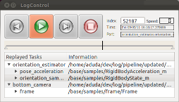

Log files are very import especially if it is expensive to run the software on
the robot in the real environment like it is very much the case, for example, in
underwater robotics. Therefore, it is the goal of Rock to provide the developer
with tools which are doing all the hard work to replay logged data to all his
components without changing his code more than necessary. For that reason it is
possible to use the same GUI for displaying logged data as well as it is used to
display live data.

If only the content of a log file matters and shall not be replayed to any
component the tool named rock-replay can be used to inspect the log files. A
double click on each listed message type will open a new widget which visualizes
the message. If no specialised widget can be found, a tree view widget is used to
display the content of the message.

{: .commandline}
rock-replay logfile1, logfile2, logfile3
{: .commandline}

{: .align-center}

As your usage of logging and Rock advances, it might be important to read [this
note](../data_analysis/replaying_logfiles.html#time) about what time does
rock-replay use to order the samples.
{: .warning}

All the mechanisms which rock-replay uses to visualizes a log file can be easily
used or extended by custom ruby scripts to display live data or log data.

For example, the code block below is using the same user interface as rock-replay
does to replay a log file to a custom qt widget.

~~~ ruby
  require 'vizkit'

  #open the log file
  replay = Orocos::Log::Replay.open("my.log")

  #create window,button and text field
  window = Qt::Widget.new
  button = Qt::PushButton.new(window)
  button.move(10,10)
  text_field = Qt::TextEdit.new(window)
  text_field.move 10,70
  window.show

  #get logged task
  task = replay.mytask
  
  #connect the logged output port with the text field
  task.mystatus.connect_to do |data,port_name|
    text_field.setText data.status.to_s
  end

  #show the control widget for the log file
  Vizkit.control replay

  #start gui
  Vizkit.exec
~~~

The next example is pretty much the start script of rock-replay

~~~ ruby
require 'vizkit'
if ARGV.empty?
  puts
  puts "Programm for replaying log files"
  puts "Usage:"
  puts "replay logfile1, logfile2, ..."
  puts
  exit 1
end

log = Orocos::Log::Replay.open(ARGV)
#all ports shall be replayed
log.track true
Vizkit.control log
Vizkit.exec
~~~

If a specific port shall be replayed Vizkit can be used to automatically find 
a display widget which can handle the type of sample. This behavior can easily
be extended by registering custom widgets with the method 
Vizkit.register_widget_for (see [this page](600_writing_vizkit_widget.html)).

~~~ ruby
require 'vizkit'
replay = Orocos::Log::Replay.open('my.log')
Vizkit.display replay.mytask.myport
Vizkit.control replay
Vizkit.exec
~~~

To specify the widget which shall be used to display the samples of the port,
the UiLoader class can be used to manually load widgets.  A complete list of
available widgets can be displayed by using the command line tool
rock-list-widgets.

~~~ ruby
require 'vizkit'
replay = Orocos::Log::Replay.open('my.log')
#create a new struct_viewer widget
widget = Vizkit.default_loader.StructViewer
replay.mytask.myport.connect_to widget
widget.show
Vizkit.control replay
Vizkit.exec 
~~~

If the same script shall be used to display remote tasks and later on log files 
the Orocos name service can be used to find the right task.

~~~ ruby
require 'vizkit'
Orocos.initialize
# load log files and add the loaded tasks to the Orocos name service
replay = Orocos::Log::Replay.open(ARGV) unless ARGV.empty?

# create a task proxy trying to connect
# to a task called "camera" with the help
# of the orocos name service
task = Orocos::Async.proxy "camera"
widget = Vizkit.default_loader.ImageView
widget.show

#connect port to the widget when reachable
task.port("frame_raw").once_on_reachable do
    Vizkit.display task.port("frame_raw"),:widget => widget
end

Vizkit.control replay unless ARGV.empty?
Vizkit.exec
~~~

